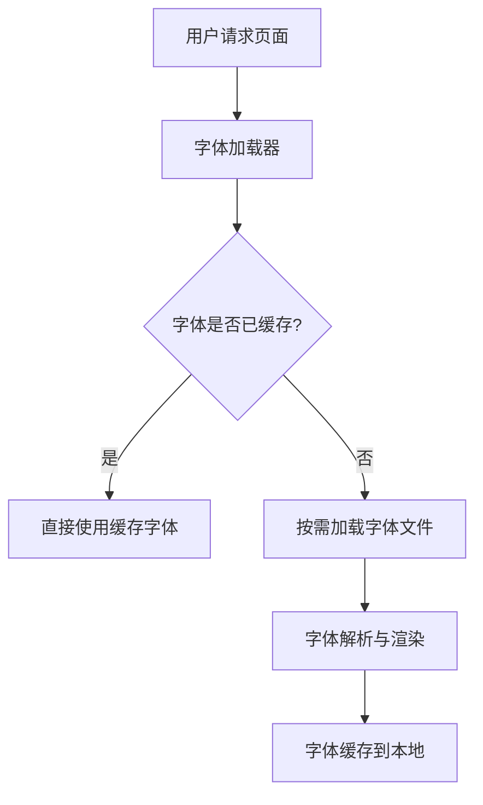

# 字体动态加载技术方案

需求名称：2026-03-14-font-dynamic-loading
更新日期：2026-03-14

## 概述

本方案针对 Web 应用中的字体资源加载进行优化，实现字体的动态加载、懒加载和性能优化功能。

## 架构



## 组件与接口

| 组件 | 职责 |
|------|------|
| FontLoader | 字体加载核心模块 |
| FontCache | 字体缓存管理 |
| FontObserver | 字体加载状态观察 |
| FontPreloader | 字体预加载组件 |

## 数据模型

```typescript
interface FontConfig {
  fontFamily: string;
  fontUrl: string;
  weight: number;
  style: 'normal' | 'italic';
  display: 'auto' | 'block' | 'swap' | 'optional' | 'fallback';
}

interface FontLoadResult {
  success: boolean;
  fontFamily: string;
  error?: string;
}
```

## 正确性属性

- 字体加载失败时回退到系统字体
- 避免字体加载导致的页面布局偏移
- 支持字体的异步加载

## 错误处理

- 网络错误：使用 fallback 字体
- 字体解析错误：记录日志并使用默认字体

## 测试策略

- 单元测试：FontLoader 核心逻辑
- 集成测试：字体加载流程
- E2E 测试：页面渲染效果验证
