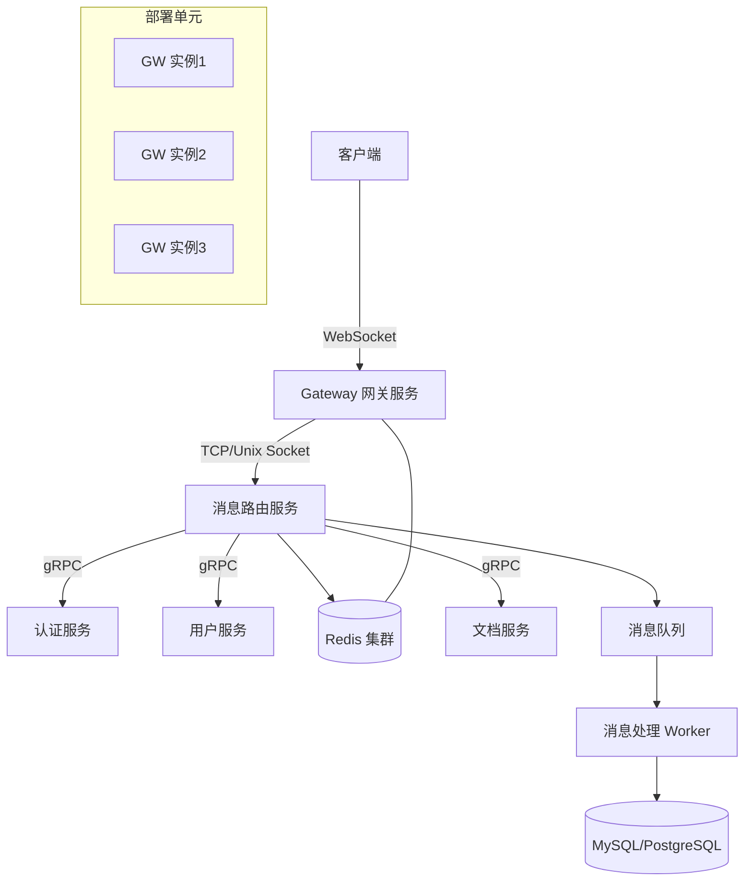
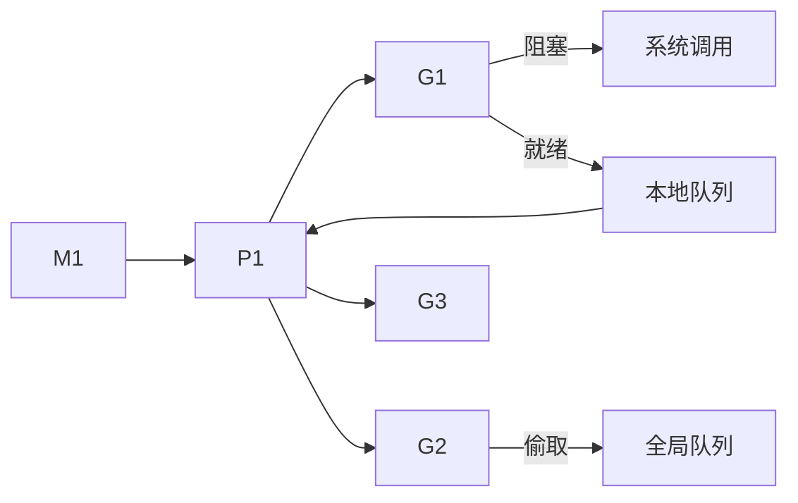
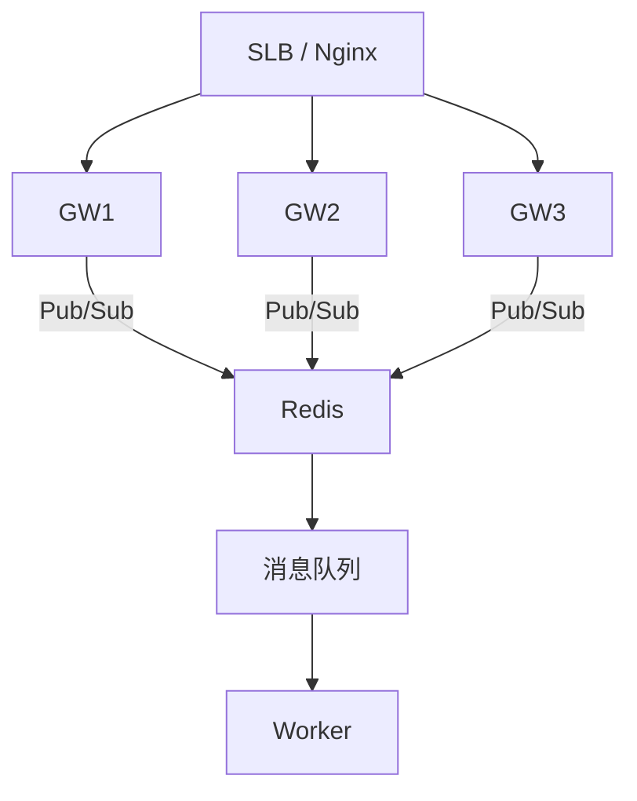

# Golang 长连接系统技术方案

需求名称：2026-03-14-golang-im-connection-system
更新日期：2026-03-14

## 1 系统概述

本方案设计一个支持 IM（即时通讯）和在线文档协作的 Golang 长连接系统。系统采用 WebSocket 作为主要通讯协议，支持万人同时在线、消息可靠投递、实时同步等核心功能。

## 2 架构设计



## 3 核心组件

| 组件 | 职责 | 技术选型 |
|------|------|----------|
| Gateway | WebSocket 接入、心跳管理、协议转换 | Golang + gorilla/websocket |
| Message Router | 消息路由、房间管理、在线状态 | Golang + gRPC |
| Auth Service | Token 验证、权限校验 | Golang + JWT |
| Presence Service | 在线状态管理、好友关系 | Redis Cluster |
| Document Sync | OT/CRDT 协作算法、实时同步 | Golang |

## 4 面试提问清单及答案

### 4.1 基础概念类

#### Q1: 长连接与短连接的区别是什么？什么时候应该使用长连接？

**答：**
- **短连接**：每次请求完成后立即关闭连接，适合 HTTP/1.1 时代的普通 API 调用
- **长连接**：建立一次连接后保持长时间不关闭，多次复用，适合实时通讯场景

**使用长连接的场景：**
- IM 消息推送
- 在线游戏
- 实时协作（文档编辑）
- 实时监控/推送通知
- 股票行情/物联网数据上报

**Golang 中的实现：**
```go
// 典型的 WebSocket 长连接
var upgrader = websocket.Upgrader{
    ReadBufferSize:  1024,
    WriteBufferSize: 1024,
}

func handler(w http.ResponseWriter, r *http.Request) {
    conn, err := upgrader.Upgrade(w, r, nil)
    if err != nil {
        return
    }
    defer conn.Close()
    
    for {
        messageType, p, err := conn.ReadMessage()
        if err != nil {
            break
        }
        // 处理消息
        process(p)
    }
}
```

---

#### Q2: WebSocket 与 SSE、HTTP Long Polling 相比有什么优缺点？

**答：**

| 特性 | WebSocket | SSE | HTTP Long Polling |
|------|-----------|-----|-------------------|
| 双向通讯 | 全双工 | 单向(server→client) | 半双工 |
| HTTP 协议 | 升级握手后脱离 HTTP | HTTP | HTTP |
| 连接数 | 1次 TCP | 1次 HTTP | 多次 HTTP |
| 兼容性 | 现代浏览器 | 主流浏览器 | 所有浏览器 |
| 代理/防火墙 | 可能有障碍 | 友好 | 友好 |
| 复杂度 | 中等 | 简单 | 中等 |

**结论：**
- IM/游戏：WebSocket 首选
- 简单通知推送：SSE 更简单
- 极端兼容场景：Long Polling 作为降级方案

---

### 4.2 Golang 并发模型类

#### Q3: Golang 的 GMP 模型是什么？请详细解释

**答：**

**GMP 模型定义：**
- **G (Goroutine)**: Go 语言的轻量级线程，由 Go 运行时管理
- **M (Machine)**: 操作系统线程，真正执行协程的实体
- **P (Processor)**: 调度器上下文，包含运行队列

**调度流程：**


**关键点：**
1. P 的数量默认等于 CPU 核心数（可通过 GOMAXPROCS 调整）
2. 本地队列满时，将一半 G 移动到全局队列
3. M 阻塞时，P 会绑定其他 M 继续执行
4. 网络 I/O 阻塞时不阻塞 M（Go 运行时网络轮询）

---

#### Q4: Go 中 channel 的实现原理是什么？无缓冲 channel 和有缓冲 channel 有什么区别？

**答：**

**Channel 底层实现：**
- 本质是一个环形队列 + 等待队列（sudog）的数据结构
- 包含：buf（环形缓冲区）、sendx（发送索引）、recvx（接收索引）、sendq/recvq（等待队列）

**无缓冲 channel：**
```go
ch := make(chan int) // 无缓冲
```
- 发送和接收必须同时进行，否则阻塞
- 适用于：两个 goroutine 之间的同步、信号传递

**有缓冲 channel：**
```go
ch := make(chan int, 10) // 缓冲大小 10
```
- 发送操作在缓冲区满之前不会阻塞
- 适用于：生产者-消费者模式、限流、消息队列

**常见面试题：**
```go
// 下面代码会输出什么？
func main() {
    ch := make(chan int, 1)
    ch <- 1
    ch <- 2 // 这里会阻塞还是报错？
    fmt.Println(<-ch)
    fmt.Println(<-ch)
}
```
**答案**：会死锁（fatal error: all goroutines are asleep - deadlock!）

---

#### Q5: Go 中 race condition 是什么？如何检测和避免？

**答：**

**Race Condition 定义：**
多个 goroutine 并发读写同一个共享资源，最终结果取决于执行顺序

**检测方法：**
```bash
go test -race ./...
go run -race main.go
```

**避免方法：**
1. **互斥锁 (sync.Mutex/RWMutex)**
2. **原子操作 (sync/atomic)**
3. **Channel 同步**
4. **sync.Once 初始化**
5. **sync.Map**（适合读多写少场景）

```go
// 示例：使用 mutex 保护共享资源
type Counter struct {
    mu    sync.Mutex
    count int
}

func (c *Counter) Inc() {
    c.mu.Lock()
    defer c.mu.Unlock()
    c.count++
}

func (c *Counter) Get() int {
    c.mu.Lock()
    defer c.mu.Unlock()
    return c.count
}
```

---

### 4.3 长连接实现类

#### Q6: 如何设计一个高性能的 WebSocket 服务器？请详细说明

**答：**

**核心设计要点：**

1. **连接管理**
```go
type Client struct {
    conn      *websocket.Conn
    send      chan []byte
    userID    int64
    roomID    int64
    connID    string
}

type Hub struct {
    clients    map[string]*Client    // connID -> Client
    rooms      map[int64]map[string]*Client  // roomID -> clients
    register   chan *Client
    unregister chan *Client
    broadcast  chan *Message
}
```

2. **消息处理**
```go
func (h *Hub) run() {
    for {
        select {
        case client := <-h.register:
            h.clients[client.connID] = client
            // 加入房间
            h.rooms[client.roomID][client.connID] = client
            
        case client := <-h.unregister:
            // 清理连接
            delete(h.clients, client.connID)
            delete(h.rooms[client.roomID], client.connID)
            close(client.send)
            
        case message := <-h.broadcast:
            // 广播到房间
            for _, client := range h.rooms[message.RoomID] {
                select {
                case client.send <- message.Data:
                default:
                    // 发送失败，清理连接
                }
            }
        }
    }
}
```

3. **读写分离**
```go
func (c *Client) readPump() {
    defer func() {
        c.hub.unregister <- c
        c.conn.Close()
    }()
    
    for {
        _, message, err := c.conn.ReadMessage()
        if err != nil {
            break
        }
        // 处理消息
        c.hub.handleMessage(c, message)
    }
}

func (c *Client) writePump() {
    defer c.conn.Close()
    
    for {
        message, ok := <-c.send
        if !ok {
            c.conn.WriteMessage(websocket.CloseMessage, []byte{})
            return
        }
        c.conn.WriteMessage(websocket.TextMessage, message)
    }
}
```

4. **性能优化点**
- 连接使用 sync.Map 或分片 Map
- 消息发送使用 channel 而非直接写
- 心跳检测及时清理死连接
- 使用对象池减少 GC 压力

---

#### Q7: 如何处理 WebSocket 连接的断线重连和消息可靠性？

**答：**

**断线重连策略：**
```go
// 客户端重连逻辑
type Reconnector struct {
    maxRetries   int
    baseDelay   time.Duration
    maxDelay    time.Duration
}

func (r *Reconnector) Connect() error {
    retries := 0
    for {
        conn, err := dialWebSocket()
        if err == nil {
            return nil
        }
        
        if retries >= r.maxRetries {
            return err
        }
        
        delay := r.baseDelay * time.Duration(math.Pow(2, float64(retries)))
        if delay > r.maxDelay {
            delay = r.maxDelay
        }
        
        time.Sleep(delay)
        retries++
    }
}
```

**消息可靠性保证：**

1. **消息确认机制 (ACK)**
```go
type Message struct {
    ID        string    // 消息唯一ID
    Type      string
    Payload   []byte
    Timestamp int64
    ACK       bool      // 是否需要确认
}

// 发送方
msgID := generateID()
sendChan := make(chan ACKResult, 1)
pendingMsgs.Store(msgID, sendChan)
sendMessage(msg)

// 接收方处理后返回 ACK
func handleMessage(msg Message) {
    process(msg)
    sendACK(msg.ID)
}

// 超时处理
go func() {
    select {
    case <-sendChan:
        // 收到确认
    case <-time.After(30 * time.Second):
        // 超时重试
        retryMessage(msgID)
    }
}()
```

2. **消息去重**
- 客户端带唯一消息 ID
- 服务端记录已处理消息 ID（Redis 集合）
- 重复消息直接返回成功

3. **离线消息存储**
- 消息持久化到数据库
- 用户上线时拉取离线消息

---

#### Q8: 如何设计心跳检测机制？请说明保活和心跳的区别

**答：**

**概念区分：**
- **TCP KeepAlive**：操作系统层面的 TCP 探针，检测连接是否存活（默认 2 小时）
- **应用层心跳**：应用主动发送的小数据包，检测业务层面的连接状态

**Go 实现：**
```go
type HeartbeatConfig struct {
    interval   time.Duration  // 发送间隔
    timeout    time.Duration  // 超时时间
    maxMissed  int            // 最大丢失次数
}

func (c *Client) startHeartbeat(cfg HeartbeatConfig) {
    ticker := time.NewTicker(cfg.interval)
    defer ticker.Stop()
    
    for {
        select {
        case <-ticker.C:
            if err := c.conn.WriteControl(websocket.PingMessage, []byte{}, time.Now().Add(cfg.timeout)); err != nil {
                // 连接已断开
                c.handleDisconnect()
                return
            }
            
        case <-c.pongCh:
            // 收到 Pong，重置计数
            c.missedCount = 0
            
        case <-time.After(cfg.timeout):
            // 超时未收到 Pong
            c.missedCount++
            if c.missedCount >= cfg.maxMissed {
                c.handleDisconnect()
                return
            }
        }
    }
}
```

---

### 4.4 IM 消息类

#### Q9: IM 系统中消息如何存储和检索？请设计消息表结构

**答：**

**消息表设计：**
```sql
CREATE TABLE messages (
    id BIGINT UNSIGNED PRIMARY KEY AUTO_INCREMENT,
    room_id BIGINT UNSIGNED NOT NULL,
    sender_id BIGINT UNSIGNED NOT NULL,
    message_type TINYINT NOT NULL DEFAULT 1 COMMENT '1:文本 2:图片 3:文件 4:系统',
    content TEXT NOT NULL,
    client_msg_id VARCHAR(64) NOT NULL COMMENT '客户端消息ID，用于去重',
    server_msg_id BIGINT NOT NULL COMMENT '服务端消息ID',
    created_at BIGINT UNSIGNED NOT NULL,
    updated_at BIGINT UNSIGNED NOT NULL,
    
    INDEX idx_room_time (room_id, created_at),
    INDEX idx_sender (sender_id),
    INDEX idx_client_msg_id (client_msg_id),
    UNIQUE KEY uk_client_msg (client_msg_id, sender_id)
) ENGINE=InnoDB DEFAULT CHARSET=utf8mb4;

-- 消息历史表（按月分表）
CREATE TABLE messages_202603 (
    LIKE messages
) ENGINE=InnoDB DEFAULT CHARSET=utf8mb4;
```

**消息检索方案：**
```go
// 分页查询
func QueryMessages(roomID int64, cursor int64, limit int) ([]Message, int64) {
    var messages []Message
    db.Where("room_id = ? AND id < ?", roomID, cursor).
        Order("id DESC").
        Limit(limit).
        Find(&messages)
    
    // 返回新的游标
    newCursor := int64(0)
    if len(messages) > 0 {
        newCursor = messages[len(messages)-1].ID
    }
    return messages, newCursor
}
```

**搜索功能：**
- 简单搜索：MySQL LIKE 查询
- 复杂搜索：Elasticsearch

---

#### Q10: 消息的顺序性如何保证？

**答：**

**单聊消息顺序：**
- 同一用户的消息按时间戳/ID 顺序即可

**群聊消息顺序：**
```go
// 方案1：单线程顺序处理
type Room struct {
    mu          sync.Mutex
    msgSeq      int64
    pendingMsgs map[int64]*Message  // 等待确认的消息
}

func (r *Room) SendMessage(msg *Message) {
    r.mu.Lock()
    defer r.mu.Unlock()
    
    msg.Seq = r.msgSeq
    r.msgSeq++
    broadcast(msg)
}
```

**分布式顺序问题：**
- 使用 Redis INCR 生成全局递增序列号
- 消息携带序列号，接收方按序列号排序
- 允许一定范围内的乱序（滑动窗口）

---

#### Q11: 如何实现已读回执和未读计数？

**答：**

**已读回执：**
```go
type ReadReceipt struct {
    userID    int64
    messageID int64
    timestamp int64
}

// 客户端发送已读消息
func handleReadReceipt(receipt ReadReceipt) {
    // 更新用户在该会话的已读位置
    key := fmt.Sprintf("read:%d:%d", receipt.userID, receipt.roomID)
    redis.Set(key, receipt.messageID)
    
    // 广播已读状态给消息发送者
    notifySender(receipt)
}
```

**未读计数：**
```go
type UnreadCount struct {
    total      int64   // 总未读
    unreadMap  map[int64]int64  // messageType -> count
}

// 获取未读数
func GetUnreadCount(userID int64) UnreadCount {
    readKey := fmt.Sprintf("read:%d", userID)
    maxReadID := redis.Get(readKey).Int64()
    
    // 从数据库获取未读
    var count int64
    db.Model(&Message{}).
        Where("room_id IN (?) AND sender_id != ? AND id > ?", 
            user.GetJoinedRooms(), userID, maxReadID).
        Count(&count)
    
    return UnreadCount{total: count}
}
```

---

### 4.5 在线文档类

#### Q12: 在线文档协作如何实现实时同步？请说明 OT/CRDT 算法

**答：**

**OT (Operational Transformation) 算法：**
- 核心思想：转换操作使冲突操作变得兼容
- 适用场景：文本编辑

```go
// 操作类型
type Operation struct {
    Type    string  // insert, delete, retain
    Pos     int     // 位置
    Content string  // 插入内容（insert 用）
    Length  int     // 长度（delete/retain 用）
}

// 转换函数
func Transform(op1, op2 *Operation) (newOp1, newOp2 *Operation) {
    if op1.Pos <= op2.Pos {
        newOp1 = op1
        newOp2 = &Operation{
            Type:   op2.Type,
            Pos:    op2.Pos + len(op1.Content) - op2.Length,
            // ...
        }
    } else {
        newOp1 = &Operation{
            Type:   op1.Type,
            Pos:    op1.Pos + len(op2.Content) - op2.Length,
            // ...
        }
        newOp2 = op2
    }
    return
}
```

**CRDT (Conflict-free Replicated Data Type)：**
- 无需中心协调的最终一致性数据结构
- 适用场景：分布式协作

```go
// LWW-Register (Last-Write-Wins)
type TextCRDT struct {
    clock  map[int64]int64  // siteID -> clock
    value  string
    time   int64
}

func (c *TextCRDT) Update(value string, siteID int64) {
    c.clock[siteID]++
    if c.clock[siteID] > c.time {
        c.value = value
        c.time = c.clock[siteID]
    }
}
```

**业界方案：**
- Google Docs：OT 算法
- Figma：CRDT
- 腾讯文档：OT + CRDT 混合

---

#### Q13: 如何处理文档冲突和版本管理？

**答：**

**版本控制设计：**
```go
type Document struct {
    ID        string
    Content   string
    Version   int64
    CreatedAt int64
    UpdatedAt int64
}

// 每次保存生成新版本
func (d *Document) Save(ops []Operation) error {
    // 应用操作
    for _, op := range ops {
        d.apply(op)
    }
    d.Version++
    d.UpdatedAt = time.Now().Unix()
    return d.persist()
}

// 历史版本回溯
func (d *Document) GetVersion(v int64) (Document, error) {
    // 从版本历史中获取
}
```

**冲突解决策略：**
1. **乐观锁**：版本号比较，冲突则提示用户
2. **自动合并**：对非冲突操作自动合并
3. **手动解决**：展示冲突内容让用户选择

---

### 4.6 分布式架构类

#### Q14: 如何设计一个支持万人同时在线的 IM 系统？

**答：**

**架构设计要点：**

1. **接入层 (Gateway)**
```go
type GatewayConfig {
    MaxConns     int           // 最大连接数
    MaxMsgLen    int           // 最大消息长度
    Heartbeat    time.Duration // 心跳间隔
}

type Server struct {
    conns    sync.Map       // connID -> *Connection
    rooms    sync.Map       // roomID -> *Room
    config   GatewayConfig
    wg       sync.WaitGroup
}

// 单实例轻松支持 10万+ 连接
// 需要更多则水平扩展 Gateway 实例
```

2. **消息路由层**
- 消息先到内存队列
- Worker 异步处理持久化
- 不阻塞消息发送

3. **水平扩展方案**


4. **数据层**
- Redis：在线状态、会话缓存、消息缓存
- MySQL：消息持久化、用户数据
- ES：消息搜索

---

#### Q15: 如何保证消息不丢包？

**答：**

**多层保障：**

1. **TCP 基础保障**
- TCP 本身可靠传输
- 但应用层可能丢失（如处理异常）

2. **应用层 ACK**
```go
// 发送消息
msg := &Message{
    ID:        generateUUID(),
    NeedACK:   true,
    Timestamp: time.Now().Unix(),
}

// 接收方确认
func handleMsg(msg Message) {
    // 处理业务
    sendACK(msg.ID, msg.SenderID)
}

// 超时重试
func (s *Sender) handleTimeout(msgID string) {
    // 重新发送
    s.retryChan <- msgID
}
```

3. **消息持久化**
- 接收方确认前，消息已在服务端持久化
- 确认后删除离线消息

4. **客户端本地缓存**
- 发送的消息本地暂存
- 收到确认后删除
- 重连后同步发送状态

---

#### Q16: 分布式环境下如何实现消息路由？

**答：**

**问题：**
- 用户 A 连接到 Gateway 1
- 用户 B 连接到 Gateway 2
- 如何让消息从 Gateway 1 发送到 Gateway 2？

**解决方案：Redis Pub/Sub**
```go
// Gateway 1 收到消息
func (g *Gateway) routeMessage(msg *Message) {
    targetUserID := msg.ReceiverID
    
    // 查找目标用户所在的 Gateway
    targetGateway := g.registry.GetGateway(targetUserID)
    
    if targetGateway == g.ID {
        // 本 Gateway，直接发送
        g.sendToClient(targetUserID, msg)
    } else {
        // 通过 Redis Pub/Sub 发送
        pubSubMsg := PubSubMessage{
            GatewayID: g.ID,
            UserID:    targetUserID,
            Message:   msg,
        }
        redis.Publish("gateway:msg", pubSubMsg)
    }
}

// 各 Gateway 订阅自己的消息
func (g *Gateway) subscribe() {
    pubsub := redis.Subscribe(g.channel)
    for msg := range pubsub {
        g.sendToClient(msg.UserID, msg.Message)
    }
}
```

---

### 4.7 性能优化类

#### Q17: Go 服务如何进行性能调优？

**答：**

**1. 基准测试**
```go
func BenchmarkSendMessage(b *testing.B) {
    hub := NewHub()
    for i := 0; i < b.N; i++ {
        hub.broadcast(&Message{Data: []byte("test")})
    }
}

// 运行
go test -bench=. -benchmem
```

**2. pprof 性能分析**
```go
import _ "net/http/pprof"

func main() {
    go func() {
        http.ListenAndServe(":6060", nil)
    }()
}

// 分析 CPU
go tool pprof http://localhost:6060/debug/pprof/profile

// 分析内存
go tool pprof http://localhost:6060/debug/pprof/heap
```

**3. 常见优化点**

| 优化点 | 方法 |
|--------|------|
| 减少 GC | 手动内存管理、使用 sync.Pool |
| 减少分配 | 复用 buffer、避免频繁 string→[]byte |
| 并发 | 合理使用 goroutine、避免过度并发 |
| I/O | 批量操作、连接池 |

**4. 内存优化示例**
```go
// 使用对象池减少分配
var msgPool = sync.Pool{
    New: func() interface{} {
        return &Message{
            Data: make([]byte, 0, 1024),
        }
    },
}

func getMessage() *Message {
    return msgPool.Get().(*Message)
}

func putMessage(m *Message) {
    m.Data = m.Data[:0]
    msgPool.Put(m)
}
```

---

#### Q18: 如何处理高并发下的热点问题？

**答：**

**热点问题场景：**
- 大 V 发送消息（广播）
- 热门群聊

**解决方案：**

1. **消息扩散**
```go
// 群发消息不直接遍历
func broadcastLargeRoom(msg *Message) {
    // 1. 消息先进入队列
    msgQueue.Push(msg)
    
    // 2. Worker 异步处理
    go func() {
        // 分片处理，避免热点
        shards := splitUsers(room.GetMembers(), 100)
        for _, shard := range shards {
            go processShard(shard, msg)
        }
    }()
}
```

2. **读写分离**
```go
// 在线列表使用 Redis
// 读取频繁，写入相对较少
// 可以使用主从分离
```

3. **限流熔断**
```go
// 令牌桶限流
type RateLimiter struct {
    rate       int
    capacity   int
    tokens     int
    lastUpdate time.Time
    mu         sync.Mutex
}

func (r *RateLimiter) Allow() bool {
    r.mu.Lock()
    defer r.mu.Unlock()
    
    now := time.Now()
    r.tokens = r.capacity - int(now.Sub(r.lastUpdate)/time.Second)*r.rate
    if r.tokens > 0 {
        r.tokens--
        return true
    }
    return false
}
```

---

### 4.8 安全类

#### Q19: WebSocket 安全方面需要注意什么？

**答：**

**1. WSS (WebSocket Secure)**
```go
// 使用 TLS
ws := websocket.Upgrader{
    CheckOrigin: func(r *http.Request) bool {
        return true // 生产环境应该验证 Origin
    },
}

// 服务端配置
// wss://domain.com/ws
```

**2. Origin 校验**
```go
var allowedOrigins = map[string]bool{
    "https://example.com": true,
    "https://app.example.com": true,
}

upgrader.CheckOrigin = func(r *http.Request) bool {
    origin := r.Header.Get("Origin")
    return allowedOrigins[origin]
}
```

**3. 消息大小限制**
```go
upgrader.ReadLimit = 1024 * 1024 // 1MB
```

**4. 心跳检测**
- 防止恶意连接占用资源
- 及时发现断开的连接

**5. 认证与授权**
- 首次握手时验证 Token
- 定期验证会话有效性

---

#### Q20: 如何防止 XSS 和恶意消息攻击？

**答：**

**1. 消息过滤**
```go
import "html"

func sanitizeMessage(msg string) string {
    return html.EscapeString(msg)
}

// 或使用第三方库
// github.com/microcosm-cc/bluemonday
```

**2. 频率限制**
```go
// 用户发送频率限制
type RateLimiter struct {
    requests map[int64][]time.Time
    limit    int
    window   time.Duration
}

func (r *RateLimiter) Allow(userID int64) bool {
    now := time.Now()
    // 清理过期记录
    r.requests[userID] = filterRecent(r.requests[userID], now, r.window)
    
    if len(r.requests[userID]) >= r.limit {
        return false
    }
    r.requests[userID] = append(r.requests[userID], now)
    return true
}
```

**3. 敏感词过滤**
```go
// 使用 DFA 算法
type DFAFilter struct {
    root   *TrieNode
}

func (f *DFAFilter) Filter(text string) string {
    // 替换敏感词为 *
}
```

---

## 5 总结

以上涵盖了 Golang 长连接系统的核心技术点和面试高频问题。候选人需要重点掌握：

1. **Golang 基础**：GMP 模型、channel、并发安全
2. **WebSocket**：连接管理、消息处理、心跳检测
3. **IM 核心**：消息存储、顺序保证、未读计数
4. **在线文档**：OT/CRDT 算法、实时同步
5. **分布式**：水平扩展、消息路由、高可用
6. **性能优化**：GC 调优、内存管理、热点处理
7. **安全**：认证、限流、防攻击
