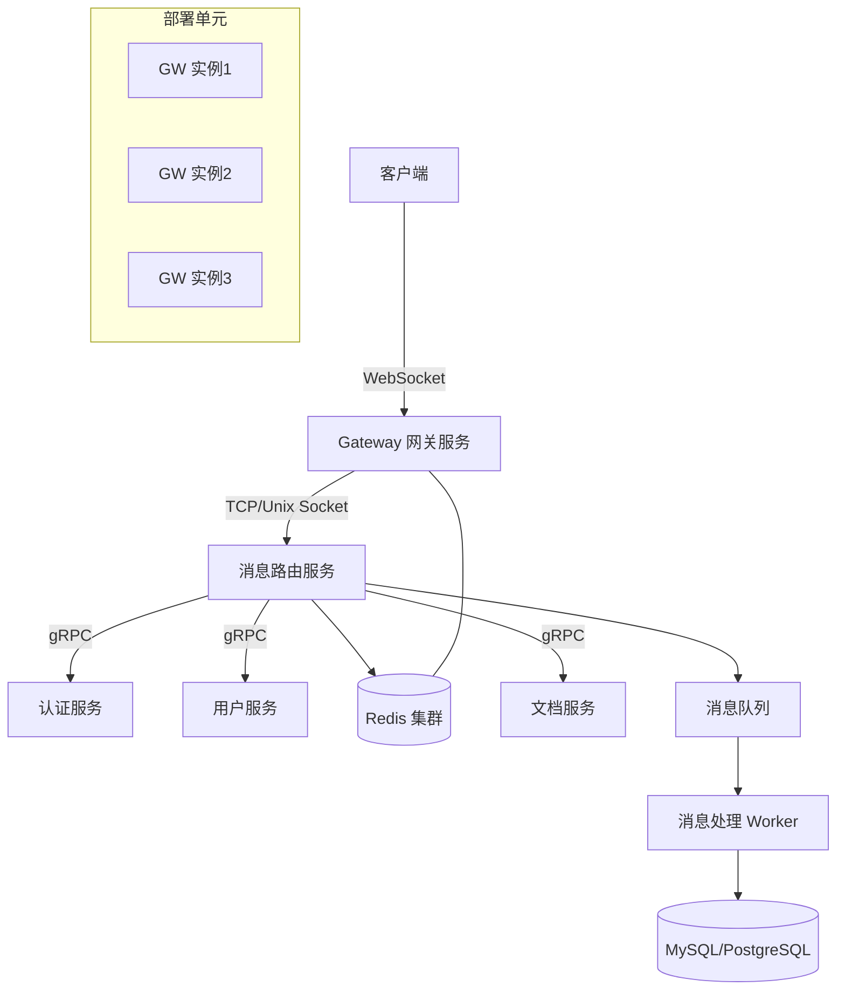
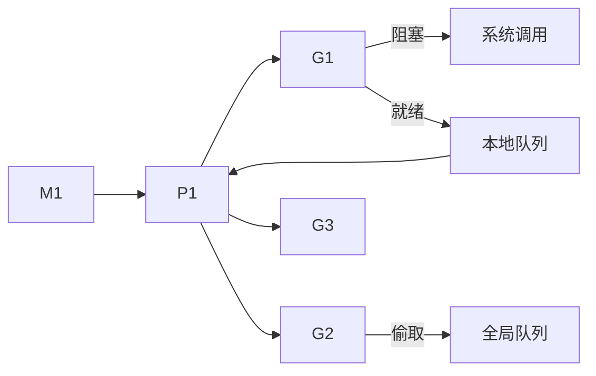
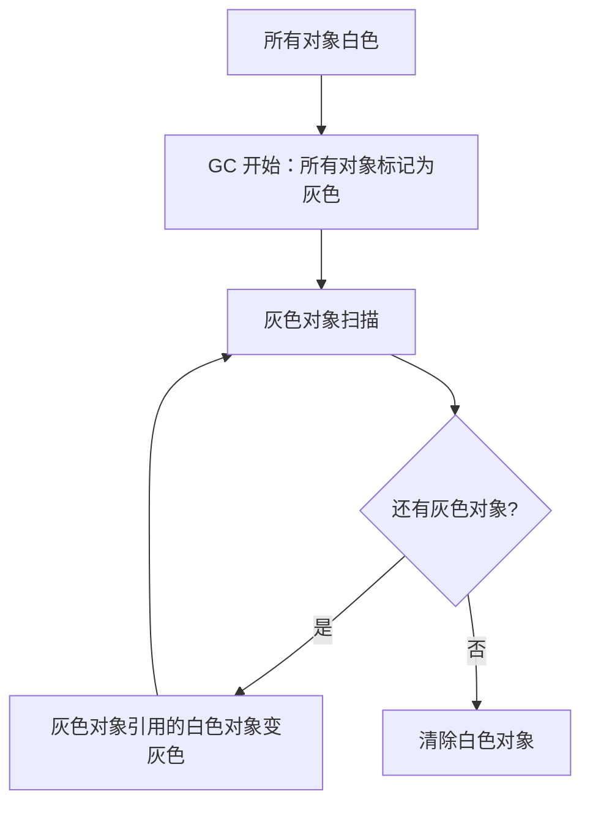
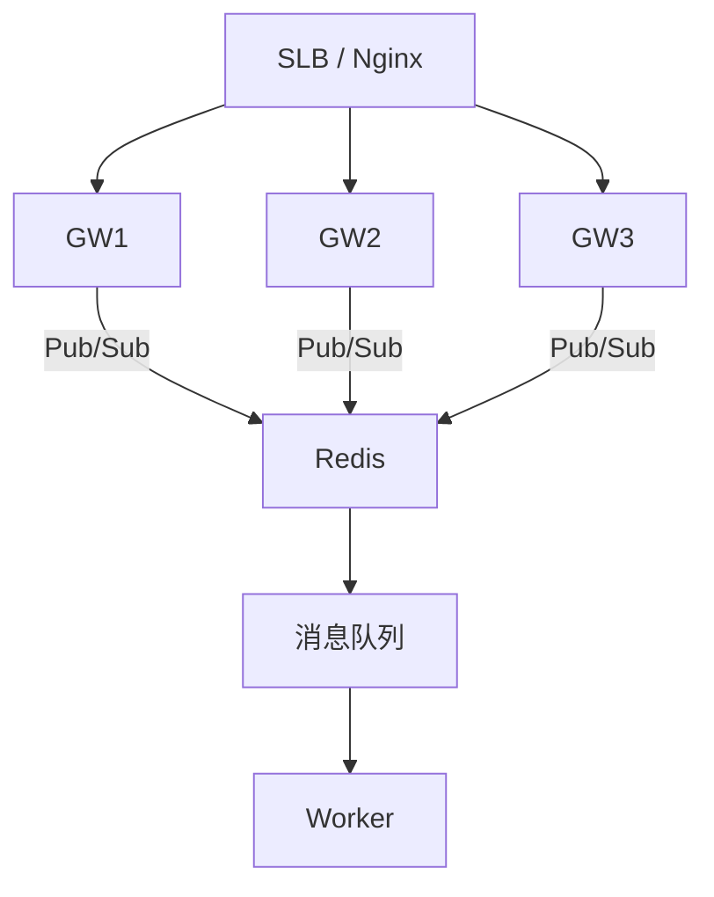

# Golang 长连接系统技术方案

需求名称：2026-03-14-golang-im-connection-system
更新日期：2026-03-14

## 1 系统概述

本方案设计一个支持 IM（即时通讯）和在线文档协作的 Golang 长连接系统。系统采用 WebSocket 作为主要通讯协议，支持万人同时在线、消息可靠投递、实时同步等核心功能。

## 2 架构设计



## 3 核心组件

| 组件 | 职责 | 技术选型 |
|------|------|----------|
| Gateway | WebSocket 接入、心跳管理、协议转换 | Golang + gorilla/websocket |
| Message Router | 消息路由、房间管理、在线状态 | Golang + gRPC |
| Auth Service | Token 验证、权限校验 | Golang + JWT |
| Presence Service | 在线状态管理、好友关系 | Redis Cluster |
| Document Sync | OT/CRDT 协作算法、实时同步 | Golang |

## 4 面试提问清单及答案

### 4.1 基础概念类

#### Q1: 长连接与短连接的区别是什么？什么时候应该使用长连接？

**答：**
- **短连接**：每次请求完成后立即关闭连接，适合 HTTP/1.1 时代的普通 API 调用
- **长连接**：建立一次连接后保持长时间不关闭，多次复用，适合实时通讯场景

**使用长连接的场景：**
- IM 消息推送
- 在线游戏
- 实时协作（文档编辑）
- 实时监控/推送通知
- 股票行情/物联网数据上报

**Golang 中的实现：**
```go
// 典型的 WebSocket 长连接
var upgrader = websocket.Upgrader{
    ReadBufferSize:  1024,
    WriteBufferSize: 1024,
}

func handler(w http.ResponseWriter, r *http.Request) {
    conn, err := upgrader.Upgrade(w, r, nil)
    if err != nil {
        return
    }
    defer conn.Close()
    
    for {
        messageType, p, err := conn.ReadMessage()
        if err != nil {
            break
        }
        // 处理消息
        process(p)
    }
}
```

---

#### Q2: WebSocket 与 SSE、HTTP Long Polling 相比有什么优缺点？

**答：**

| 特性 | WebSocket | SSE | HTTP Long Polling |
|------|-----------|-----|-------------------|
| 双向通讯 | 全双工 | 单向(server→client) | 半双工 |
| HTTP 协议 | 升级握手后脱离 HTTP | HTTP | HTTP |
| 连接数 | 1次 TCP | 1次 HTTP | 多次 HTTP |
| 兼容性 | 现代浏览器 | 主流浏览器 | 所有浏览器 |
| 代理/防火墙 | 可能有障碍 | 友好 | 友好 |
| 复杂度 | 中等 | 简单 | 中等 |

**结论：**
- IM/游戏：WebSocket 首选
- 简单通知推送：SSE 更简单
- 极端兼容场景：Long Polling 作为降级方案

---

#### Q3: 为什么 TCP 是可靠传输，还需要应用层 ACK？

**答：**

**TCP 可靠性的局限：**
1. **TCP 只保证数据到达对方，但不保证应用层处理成功**
   - 服务端收到消息后，数据库写入失败
   - 消息处理过程中服务崩溃
   - 进程被 OOM Kill

2. **TCP ACK 只确认到达，不确认业务处理**
   ```mermaid
   sequenceDiagram
       Client->>Server: 发送消息(msg_001)
       Server->>DB: 写入数据库
       DB-->>Server: 写入失败
       Server-->>Client: TCP ACK (仅确认收到)
       Note over Server,Client: 消息丢失！客户端以为发送成功
   ```

3. **网络分层导致的"成功"假象**
   - TCP 三次握手成功
   - 应用层处理失败
   - 客户端收到 ACK，但实际未处理

**应用层 ACK 的必要性：**
- 确认业务处理完成
- 支持重试机制
- 实现消息可靠投递

---

#### Q4: HTTP/2 和 WebSocket 在长连接场景下如何选择？

**答：**

**HTTP/2 特性：**
- 多路复用：单一 TCP 连接上并行多个请求
- 头部压缩：HPACK 算法
- 服务端推送
- 流控制

**WebSocket 特性：**
- 全双工通讯
- 自定义协议
- 实时性强

**选择建议：**

| 场景 | 推荐方案 |
|------|----------|
| 纯服务端推送（通知） | HTTP/2 Server Push |
| 双向实时通讯 | WebSocket |
| 需要 REST 兼容性 | HTTP/2 + SSE |
| 低延迟游戏/IM | WebSocket |
| API + 实时更新混合 | HTTP/2 多路复用 |

**Golang HTTP/2 示例：**
```go
// HTTP/2 服务端推送
func handler(w http.ResponseWriter, r *http.Request) {
    pusher, ok := w.(http.Pusher)
    if ok {
        // 推送静态资源
        pusher.Push("/static/app.js", nil)
    }
    // 正常处理
}
```

---

#### Q5: 什么是半双工和全双工？WebSocket 是如何实现全双工的？

**答：**

**概念定义：**
- **半双工**：同一时刻只能一方发送数据（对讲机）
- **全双工**：双方可以同时发送数据（电话）

**HTTP/1.1 困境：**
- 请求-响应模式
- 必须等响应返回才能发下一个请求
- 即使 pipelining 也无法真正并行

**WebSocket 全双工实现：**
```go
// 读写分离的两个 goroutine
func (c *Client) readPump() {
    for {
        _, msg, err := c.conn.ReadMessage()
        if err != nil {
            break
        }
        // 处理读取
    }
}

func (c *Client) writePump() {
    for {
        msg := <-c.sendChan
        // 处理写入
        err := c.conn.WriteMessage(websocket.TextMessage, msg)
    }
}

// 启动两个 goroutine
go c.readPump()
go c.writePump()
```

---

### 4.2 Golang 并发模型类

#### Q6: Golang 的 GMP 模型是什么？请详细解释

**答：**

**GMP 模型定义：**
- **G (Goroutine)**: Go 语言的轻量级线程，由 Go 运行时管理
- **M (Machine)**: 操作系统线程，真正执行协程的实体
- **P (Processor)**: 调度器上下文，包含运行队列

**调度流程：**


**关键点：**
1. P 的数量默认等于 CPU 核心数（可通过 GOMAXPROCS 调整）
2. 本地队列满时，将一半 G 移动到全局队列
3. M 阻塞时，P 会绑定其他 M 继续执行
4. 网络 I/O 阻塞时不阻塞 M（Go 运行时网络轮询）

---

#### Q7: Go 中 channel 的实现原理是什么？无缓冲 channel 和有缓冲 channel 有什么区别？

**答：**

**Channel 底层实现：**
- 本质是一个环形队列 + 等待队列（sudog）的数据结构
- 包含：buf（环形缓冲区）、sendx（发送索引）、recvx（接收索引）、sendq/recvq（等待队列）

**无缓冲 channel：**
```go
ch := make(chan int) // 无缓冲
```
- 发送和接收必须同时进行，否则阻塞
- 适用于：两个 goroutine 之间的同步、信号传递

**有缓冲 channel：**
```go
ch := make(chan int, 10) // 缓冲大小 10
```
- 发送操作在缓冲区满之前不会阻塞
- 适用于：生产者-消费者模式、限流、消息队列

**常见面试题：**
```go
// 下面代码会输出什么？
func main() {
    ch := make(chan int, 1)
    ch <- 1
    ch <- 2 // 这里会阻塞还是报错？
    fmt.Println(<-ch)
    fmt.Println(<-ch)
}
```
**答案**：会死锁（fatal error: all goroutines are asleep - deadlock!）

---

#### Q8: Go 中 race condition 是什么？如何检测和避免？

**答：**

**Race Condition 定义：**
多个 goroutine 并发读写同一个共享资源，最终结果取决于执行顺序

**检测方法：**
```bash
go test -race ./...
go run -race main.go
```

**避免方法：**
1. **互斥锁 (sync.Mutex/RWMutex)**
2. **原子操作 (sync/atomic)**
3. **Channel 同步**
4. **sync.Once 初始化**
5. **sync.Map**（适合读多写少场景）

```go
// 示例：使用 mutex 保护共享资源
type Counter struct {
    mu    sync.Mutex
    count int
}

func (c *Counter) Inc() {
    c.mu.Lock()
    defer c.mu.Unlock()
    c.count++
}

func (c *Counter) Get() int {
    c.mu.Lock()
    defer c.mu.Unlock()
    return c.count
}
```

---

#### Q9: Go 的调度器如何处理阻塞的 Goroutine？

**答：**

**阻塞类型及处理：**

| 阻塞类型 | 示例 | Go 调度器处理 |
|---------|------|--------------|
| I/O 阻塞 | 网络读写 | 网络轮询器接管，不阻塞 M |
| 系统调用 | 文件读写 | M 进入阻塞，P 绑定新 M |
| Channel 阻塞 | <-ch | G 放入等待队列，M 继续执行其他 G |
| Mutex 阻塞 | mu.Lock() | G 放入等待队列，M 继续执行 |
| Sleep | time.Sleep() | G 放入定时器，M 继续执行 |

**关键设计：**
```go
// 网络 I/O 不阻塞 M 的原理
func main() {
    // Go 运行时会调用 netpoll/epoll
    // 阻塞的 G 会被放到网络轮询器
    // M 可以继续执行其他 G
    resp, err := http.Get("https://example.com")
}
```

---

#### Q10: 什么是协程泄漏？如何排查和避免？

**答：**

**协程泄漏场景：**
1. **Channel 泄漏**：发送方或接收方阻塞
   ```go
   func leak() {
       ch := make(chan int)
       go func() {
           ch <- 1 // 永远没有人接收
       }()
       // 函数返回，goroutine 泄漏
   }
   ```

2. **互斥锁未释放**
   ```go
   func leak() {
       mu.Lock()
       return // 忘记 Unlock，goroutine 会一直等待
   }
   ```

3. **Defer 死循环**
   ```go
   func leak() {
       for {
           // 缺少退出条件
       }
   }
   ```

**排查方法：**
```go
// 1. pprof 查看 goroutine 数量
import "runtime/pprof"

func main() {
    // 定期打印 goroutine 数量
    for {
        time.Sleep(5 * time.Second)
        fmt.Println("Goroutines:", runtime.NumGoroutine())
    }
}

// 2. pprof heap 分析
go tool pprof http://localhost:6060/debug/pprof/goroutine
```

**避免策略：**
- 使用 context 超时
- Channel 设置缓冲并配合 select + default
- 资源使用 defer 释放
- 合理使用 worker pool

---

#### Q11: sync.Map 适合什么场景？为什么比 map + mutex 慢？

**答：**

**sync.Map 适用场景：**
1. 读多写少的并发场景
2. key 是一次写入，多次读取
3. 不知道 key 数量

**不适合场景：**
- 写多读少
- 需要对 map 进行完全遍历

**性能对比：**
```go
// 普通 map + mutex
type SafeMap struct {
    mu sync.RWMutex
    m  map[string]int
}

// sync.Map 内部实现更复杂，有额外开销
// 在低并发下，mutex 方案更快
```

**sync.Map 内部原理：**
```go
// 简化理解
type Map struct {
    mu sync.RWMutex
    read atomic.Value // readOnly
    dirty map[string]interface{}
    misses int
}
```
- read 字段用 atomic 实现无锁读
- 写入时加锁，更新 dirty
- 一定次数的 miss 后，提升 dirty 为 read

---

#### Q12: Go 的 GC 是如何工作的？什么情况会导致 GC 变慢？

**答：**

**GC 工作原理（三色标记清除）：**


**GC 阶段：**
1. **Mark Start**：STW，扫描根对象
2. **Mark**：并发标记
3. **Mark Termination**：STW，完成标记
4. **Sweep**：并发清除
5. **GC Percent**：根据内存增长触发

**导致 GC 慢的原因：**
1. **对象分配过快**
   - 大量小对象分配
   - 内存增长率超过 GC 回收速度

2. **指针引用复杂**
   - 大量跨代引用
   - 扫描时间长

3. **STW 时间过长**
   - Mark Termination 阶段
   - 内存过大

**优化方法：**
```go
// 1. 减少对象分配
// 预先分配
buf := make([]byte, 0, 1024)

// 2. 使用 sync.Pool
var bufferPool = sync.Pool{
    New: func() interface{} {
        return new(bytes.Buffer)
    },
}

// 3. 避免内存逃逸
// 尽量在栈上分配，避免返回指针
```

---

#### Q13: 详细解释 Go 的内存逃逸分析

**答：**

**逃逸场景：**
```go
func escape1() *int {
    x := 1
    return &x // x 逃逸到堆
}

func escape2() int {
    x := 1
    return x // x 在栈上
}

func escape3() []int {
    s := []int{1, 2, 3}
    return s // s 逃逸到堆
}

func escape4(s []int) {
    fmt.Println(s) // s 逃逸，因为 fmt.Println 参数可能是 interface{}
}
```

**逃逸规则：**
- 返回局部变量指针 → 逃逸
- 发送指针/channel 到 channel → 逃逸
- slice/Map/Channel 动态增长 → 可能逃逸
- interface 类型参数 → 可能逃逸

**查看逃逸：**
```bash
go build -gcflags '-m -m' main.go
```

**避免逃逸：**
```go
// 不好：返回指针，逃逸到堆
func process() *Result {
    r := &Result{}
    return r
}

// 好：使用值返回
func process() Result {
    r := Result{}
    return r
}

// 使用 sync.Pool
var pool = sync.Pool{
    New: func() interface{} {
        return &Buffer{}
    },
}
```

---

### 4.3 长连接实现类

#### Q14: 如何设计一个高性能的 WebSocket 服务器？请详细说明

**答：**

**核心设计要点：**

1. **连接管理**
```go
type Client struct {
    conn      *websocket.Conn
    send      chan []byte
    userID    int64
    roomID    int64
    connID    string
}

type Hub struct {
    clients    map[string]*Client    // connID -> Client
    rooms      map[int64]map[string]*Client  // roomID -> clients
    register   chan *Client
    unregister chan *Client
    broadcast  chan *Message
}
```

2. **消息处理**
```go
func (h *Hub) run() {
    for {
        select {
        case client := <-h.register:
            h.clients[client.connID] = client
            // 加入房间
            h.rooms[client.roomID][client.connID] = client
            
        case client := <-h.unregister:
            // 清理连接
            delete(h.clients, client.connID)
            delete(h.rooms[client.roomID], client.connID)
            close(client.send)
            
        case message := <-h.broadcast:
            // 广播到房间
            for _, client := range h.rooms[message.RoomID] {
                select {
                case client.send <- message.Data:
                default:
                    // 发送失败，清理连接
                }
            }
        }
    }
}
```

3. **读写分离**
```go
func (c *Client) readPump() {
    defer func() {
        c.hub.unregister <- c
        c.conn.Close()
    }()
    
    for {
        _, message, err := c.conn.ReadMessage()
        if err != nil {
            break
        }
        // 处理消息
        c.hub.handleMessage(c, message)
    }
}

func (c *Client) writePump() {
    defer c.conn.Close()
    
    for {
        message, ok := <-c.send
        if !ok {
            c.conn.WriteMessage(websocket.CloseMessage, []byte{})
            return
        }
        c.conn.WriteMessage(websocket.TextMessage, message)
    }
}
```

4. **性能优化点**
- 连接使用 sync.Map 或分片 Map
- 消息发送使用 channel 而非直接写
- 心跳检测及时清理死连接
- 使用对象池减少 GC 压力

---

#### Q15: 如何处理 WebSocket 连接的断线重连和消息可靠性？

**答：**

**断线重连策略：**
```go
// 客户端重连逻辑
type Reconnector struct {
    maxRetries   int
    baseDelay   time.Duration
    maxDelay    time.Duration
}

func (r *Reconnector) Connect() error {
    retries := 0
    for {
        conn, err := dialWebSocket()
        if err == nil {
            return nil
        }
        
        if retries >= r.maxRetries {
            return err
        }
        
        delay := r.baseDelay * time.Duration(math.Pow(2, float64(retries)))
        if delay > r.maxDelay {
            delay = r.maxDelay
        }
        
        time.Sleep(delay)
        retries++
    }
}
```

**消息可靠性保证：**

1. **消息确认机制 (ACK)**
```go
type Message struct {
    ID        string    // 消息唯一ID
    Type      string
    Payload   []byte
    Timestamp int64
    ACK       bool      // 是否需要确认
}

// 发送方
msgID := generateID()
sendChan := make(chan ACKResult, 1)
pendingMsgs.Store(msgID, sendChan)
sendMessage(msg)

// 接收方处理后返回 ACK
func handleMessage(msg Message) {
    process(msg)
    sendACK(msg.ID)
}

// 超时处理
go func() {
    select {
    case <-sendChan:
        // 收到确认
    case <-time.After(30 * time.Second):
        // 超时重试
        retryMessage(msgID)
    }
}()
```

2. **消息去重**
- 客户端带唯一消息 ID
- 服务端记录已处理消息 ID（Redis 集合）
- 重复消息直接返回成功

3. **离线消息存储**
- 消息持久化到数据库
- 用户上线时拉取离线消息

---

#### Q16: 如何设计心跳检测机制？请说明保活和心跳的区别

**答：**

**概念区分：**
- **TCP KeepAlive**：操作系统层面的 TCP 探针，检测连接是否存活（默认 2 小时）
- **应用层心跳**：应用主动发送的小数据包，检测业务层面的连接状态

**Go 实现：**
```go
type HeartbeatConfig struct {
    interval   time.Duration  // 发送间隔
    timeout    time.Duration  // 超时时间
    maxMissed  int            // 最大丢失次数
}

func (c *Client) startHeartbeat(cfg HeartbeatConfig) {
    ticker := time.NewTicker(cfg.interval)
    defer ticker.Stop()
    
    for {
        select {
        case <-ticker.C:
            if err := c.conn.WriteControl(websocket.PingMessage, []byte{}, time.Now().Add(cfg.timeout)); err != nil {
                // 连接已断开
                c.handleDisconnect()
                return
            }
            
        case <-c.pongCh:
            // 收到 Pong，重置计数
            c.missedCount = 0
            
        case <-time.After(cfg.timeout):
            // 超时未收到 Pong
            c.missedCount++
            if c.missedCount >= cfg.maxMissed {
                c.handleDisconnect()
                return
            }
        }
    }
}
```

---

#### Q17: WebSocket 断线如何快速感知？有哪些方案？

**答：**

**方案对比：**

| 方案 | 优点 | 缺点 |
|------|------|------|
| 应用层心跳 | 灵活、可携带业务数据 | 需要代码实现 |
| TCP KeepAlive | 操作系统原生 | 默认时间太长 |
| TCP 快速探测 | 可自定义超时 | 需要配置 |
| 读写超时 | 简单直接 | 可能误判 |

**最佳实践组合：**
```go
type Connection struct {
    conn         *websocket.Conn
    readTimeout  time.Duration
    writeTimeout time.Duration
}

func (c *Connection) ReadMessage() (int, []byte, error) {
    // 设置读超时
    c.conn.SetReadDeadline(time.Now().Add(c.readTimeout))
    return c.conn.ReadMessage()
}

// 组合方案
func (c *Client) monitor() {
    // 1. 读写超时检测断线
    // 2. 定期应用层心跳确认存活
    // 3. TCP KeepAlive 作为最后防线
}
```

---

#### Q18: 如何处理 WebSocket 消息积压问题？

**答：**

**问题场景：**
- 客户端网络慢
- 发送方速度 > 接收方处理速度
- Channel 缓冲区爆满

**解决方案：**

1. **Channel 丢弃策略**
```go
select {
case c.send <- msg:
default:
    // 缓冲区满，丢弃最旧消息
    select {
    case <-c.send:
        c.send <- msg
    default:
        // 消息太新，丢弃
    }
}
```

2. **发送窗口机制**
```go
type Sender struct {
    pending    map[string]*Message
    windowSize int
    acked      chan string
}

func (s *Sender) Send(msg *Message) error {
    if len(s.pending) >= s.windowSize {
        return errors.New("window full")
    }
    s.pending[msg.ID] = msg
    return nil
}
```

3. **背压处理**
```go
// 让发送方感知处理速度
type BackPressure struct {
    send    chan []byte
    recvAck chan int // 接收方反馈处理速度
}

func (s *Sender) adjustRate() {
    rate := <-s.recvAck
    if rate < 10 {
        s.interval *= 2 // 降速
    }
}
```

---

#### Q19: 如何设计 WebSocket 协议帧？消息分片如何处理？

**答：**

**WebSocket 帧格式：**
```
 0                   1                   2                   3
 0 1 2 3 4 5 6 7 8 9 0 1 2 3 4 5 6 7 8 9 0 1 2 3 4 5 6 7 8 9 0 1
+-+-+-+-+-------+-+-------------+-------------------------------+
|F|R|R|R| opcode|M| Payload len |    Extended payload length    |
|I|S|S|S|  (4)  |A|     (7)     |             (16/64)           |
|N|V|V|V|       |S|             |   (if payload len==126/127)   |
| |1|2|3|       |K|             |                               |
+-+---------------+---------------+ - - - - - - - - - - - - - - +
|     Extended payload length continued, if payload len==127  |
+ - - - - - - - - - - - - - - - - - - - - - - - +-------------+
|                               | Masking-key, if MASK set to 1 |
+-------------------------------+-------------------------------+
|    Masking-key (continued)    |          Payload Data         |
+-------------------------------- - - - - - - - - - - - - - - - +
:                     Payload Data continued ...                :
+ - - - - - - - - - - - - - - - - - - - - - - - - - - - - - - - +
|                     Payload Data continued ...                |
+---------------------------------------------------------------+
```

**消息分片示例：**
```go
type FragmentedMessage struct {
    fin         bool
    opcode      int
    messageID   string
    fragments   [][]byte
}

func handleFragment(msg websocket.Message) *FragmentedMessage {
    if msg.FIN {
        return &FragmentedMessage{
            fin:       true,
            opcode:    msg.Opcode,
            messageID: msg.MessageID,
            fragments: [][]byte{msg.Payload},
        }
    }
    
    // 收集分片
    return collectFragment(msg)
}
```

---

#### Q20: 如何设计消息的压缩传输？

**答：**

**压缩方案选择：**

| 方案 | 压缩率 | CPU 消耗 | 适用场景 |
|------|--------|----------|----------|
| gzip | 高 | 中 | 文本消息 |
| snappy | 中 | 低 | 实时性要求高 |
| lz4 | 中 | 低 | 高速传输 |
| zstd | 高 | 中高 | 平衡场景 |

**WebSocket 压缩扩展：**
```go
// 启用 per-message deflate 扩展
config := websocket.Config{
    Compression: websocketCompression,
}

upgrader := websocket.Upgrader{
    EnableCompression: true,
}
```

**自定义压缩：**
```go
func compressMessage(data []byte) ([]byte, error) {
    var buf bytes.Buffer
    w, _ := zlib.NewWriterLevel(&buf, zlib.BestCompression)
    _, err := w.Write(data)
    if err != nil {
        return nil, err
    }
    w.Close()
    return buf.Bytes(), nil
}
```

---

### 4.4 IM 消息类

#### Q21: IM 系统中消息如何存储和检索？请设计消息表结构

**答：**

**消息表设计：**
```sql
CREATE TABLE messages (
    id BIGINT UNSIGNED PRIMARY KEY AUTO_INCREMENT,
    room_id BIGINT UNSIGNED NOT NULL,
    sender_id BIGINT UNSIGNED NOT NULL,
    message_type TINYINT NOT NULL DEFAULT 1 COMMENT '1:文本 2:图片 3:文件 4:系统',
    content TEXT NOT NULL,
    client_msg_id VARCHAR(64) NOT NULL COMMENT '客户端消息ID，用于去重',
    server_msg_id BIGINT NOT NULL COMMENT '服务端消息ID',
    created_at BIGINT UNSIGNED NOT NULL,
    updated_at BIGINT UNSIGNED NOT NULL,
    
    INDEX idx_room_time (room_id, created_at),
    INDEX idx_sender (sender_id),
    INDEX idx_client_msg_id (client_msg_id),
    UNIQUE KEY uk_client_msg (client_msg_id, sender_id)
) ENGINE=InnoDB DEFAULT CHARSET=utf8mb4;

-- 消息历史表（按月分表）
CREATE TABLE messages_202603 (
    LIKE messages
) ENGINE=InnoDB DEFAULT CHARSET=utf8mb4;
```

**消息检索方案：**
```go
// 分页查询
func QueryMessages(roomID int64, cursor int64, limit int) ([]Message, int64) {
    var messages []Message
    db.Where("room_id = ? AND id < ?", roomID, cursor).
        Order("id DESC").
        Limit(limit).
        Find(&messages)
    
    // 返回新的游标
    newCursor := int64(0)
    if len(messages) > 0 {
        newCursor = messages[len(messages)-1].ID
    }
    return messages, newCursor
}
```

**搜索功能：**
- 简单搜索：MySQL LIKE 查询
- 复杂搜索：Elasticsearch

---

#### Q22: 消息的顺序性如何保证？

**答：**

**单聊消息顺序：**
- 同一用户的消息按时间戳/ID 顺序即可

**群聊消息顺序：**
```go
// 方案1：单线程顺序处理
type Room struct {
    mu          sync.Mutex
    msgSeq      int64
    pendingMsgs map[int64]*Message  // 等待确认的消息
}

func (r *Room) SendMessage(msg *Message) {
    r.mu.Lock()
    defer r.mu.Unlock()
    
    msg.Seq = r.msgSeq
    r.msgSeq++
    broadcast(msg)
}
```

**分布式顺序问题：**
- 使用 Redis INCR 生成全局递增序列号
- 消息携带序列号，接收方按序列号排序
- 允许一定范围内的乱序（滑动窗口）

---

#### Q23: 如何实现已读回执和未读计数？

**答：**

**已读回执：**
```go
type ReadReceipt struct {
    userID    int64
    messageID int64
    timestamp int64
}

// 客户端发送已读消息
func handleReadReceipt(receipt ReadReceipt) {
    // 更新用户在该会话的已读位置
    key := fmt.Sprintf("read:%d:%d", receipt.userID, receipt.roomID)
    redis.Set(key, receipt.messageID)
    
    // 广播已读状态给消息发送者
    notifySender(receipt)
}
```

**未读计数：**
```go
type UnreadCount struct {
    total      int64   // 总未读
    unreadMap  map[int64]int64  // messageType -> count
}

// 获取未读数
func GetUnreadCount(userID int64) UnreadCount {
    readKey := fmt.Sprintf("read:%d", userID)
    maxReadID := redis.Get(readKey).Int64()
    
    // 从数据库获取未读
    var count int64
    db.Model(&Message{}).
        Where("room_id IN (?) AND sender_id != ? AND id > ?", 
            user.GetJoinedRooms(), userID, maxReadID).
        Count(&count)
    
    return UnreadCount{total: count}
}
```

---

#### Q24: 消息 ID 如何设计？分布式 ID 生成方案有哪些？

**答：**

**常见方案对比：**

| 方案 | 优点 | 缺点 | 适用场景 |
|------|------|------|----------|
| UUID | 无需中心、简单 | 无序、占用空间大 | 客户端生成 |
| 数据库自增 | 有序、简单 | 单点瓶颈 | 单库 |
| Snowflake | 有序、高性能 | 依赖时钟 | 分布式 |
| Leaf | 高可用、趋势递增 | 复杂 | 大规模 |

**Snowflake 算法：**
```go
type Snowflake struct {
    mu        sync.Mutex
    timestamp int64
    workerID  int64
    sequence  int64
}

func (s *Snowflake) NextID() int64 {
    s.mu.Lock()
    defer s.mu.Unlock()
    
    now := time.Now().UnixMilli()
    if now == s.timestamp {
        s.sequence++
        if s.sequence > 4095 {
            // 等待下一毫秒
            for now <= s.timestamp {
                now = time.Now().UnixMilli()
            }
        }
    } else {
        s.sequence = 0
    }
    s.timestamp = now
    
    // 组装 ID
    id := (now-1609459200000) << 22   // 时间戳
    id |= s.workerID << 12             // 工作机器ID
    id |= s.sequence                   // 序列号
    return id
}
```

---

#### Q25: 消息撤回和消息删除有什么区别？如何实现？

**答：**

**概念区分：**
- **撤回**：发送方撤回，消息对双方都不可见
- **删除**：接收方删除，只对当前用户不可见

**撤回实现：**
```go
type RecallMessage struct {
    OriginalMsgID  string    // 被撤回的消息ID
    RecallTime     int64
    RecallUserID   int64
}

// 撤回逻辑
func RecallMessage(msg RecallMessage) error {
    // 1. 更新原消息状态
    db.Model(&Message{}).
        Where("id = ?", msg.OriginalMsgID).
        Updates(map[string]interface{}{
            "is_recalled":  true,
            "recall_time":  msg.RecallTime,
            "recall_user":  msg.RecallUserID,
        })
    
    // 2. 通知接收方
    notifyUser(msg.ReceiverID, &Notification{
        Type:    "message_recalled",
        MsgID:   msg.OriginalMsgID,
    })
    
    return nil
}
```

**逻辑删除 vs 物理删除：**
```go
// 推荐逻辑删除
type Message struct {
    IsDeleted bool `gorm:"default:false"`
}

// 查询时过滤
func QueryMessages() []Message {
    return db.Where("is_deleted = ?", false).Find(&messages)
}
```

---

#### Q26: 消息的草稿功能如何设计？

**答：**

**草稿存储：**
```go
type Draft struct {
    UserID     int64
    RoomID     int64
    Content    string
    UpdatedAt  int64
}

// 保存草稿（每次输入时保存）
func SaveDraft(userID, roomID int64, content string) {
    key := fmt.Sprintf("draft:%d:%d", userID, roomID)
    redis.Set(key, content, 24*time.Hour)
}

// 获取草稿
func GetDraft(userID, roomID int64) string {
    key := fmt.Sprintf("draft:%d:%d", userID, roomID)
    return redis.Get(key)
}

// 发送消息时删除草稿
func SendMessage(userID, roomID int64, content string) {
    // 发送逻辑...
    // 删除草稿
    key := fmt.Sprintf("draft:%d:%d", userID, roomID)
    redis.Del(key)
}
```

**注意事项：**
- 草稿不需要持久化到数据库，Redis 即可
- 设置过期时间（如 24 小时）
- 发送消息成功后立即清理

---

#### Q27: 如何实现@mention 功能？@所有人如何处理性能？

**答：**

**@功能实现：**
```go
type Mention struct {
    Type      string  // "user" 或 "all"
    UserIDs   []int64
    MessageID int64
}

// 解析消息中的 @ 提及
func ParseMentions(content string) *Mention {
    mention := &Mention{
        Type:    "user",
        UserIDs: []int64{},
    }
    
    // 正则匹配 @user 或 @所有人
    re := regexp.MustCompile(`@(\d+|所有人)`)
    matches := re.FindAllStringSubmatch(content, -1)
    
    for _, m := range matches {
        if m[1] == "所有人" {
            mention.Type = "all"
            break
        }
        userID, _ := strconv.ParseInt(m[1], 10, 64)
        mention.UserIDs = append(mention.UserIDs, userID)
    }
    
    return mention
}

// @所有人 性能优化
func BroadcastToAll(roomID int64, msg *Message) {
    // 1. 先写入消息表
    db.Create(msg)
    
    // 2. 异步推送，不阻塞主流程
    go func() {
        members := getRoomMembers(roomID)
        
        // 分批推送，避免瞬间冲击
        batches := splitBatch(members, 100)
        for _, batch := range batches {
            for _, member := range batch {
                pushToUser(member.ID, msg)
            }
        }
    }()
}
```

---

### 4.5 在线文档类

#### Q28: 在线文档协作如何实现实时同步？请说明 OT/CRDT 算法

**答：**

**OT (Operational Transformation) 算法：**
- 核心思想：转换操作使冲突操作变得兼容
- 适用场景：文本编辑

```go
// 操作类型
type Operation struct {
    Type    string  // insert, delete, retain
    Pos     int     // 位置
    Content string  // 插入内容（insert 用）
    Length  int     // 长度（delete/retain 用）
}

// 转换函数
func Transform(op1, op2 *Operation) (newOp1, newOp2 *Operation) {
    if op1.Pos <= op2.Pos {
        newOp1 = op1
        newOp2 = &Operation{
            Type:   op2.Type,
            Pos:    op2.Pos + len(op1.Content) - op2.Length,
            // ...
        }
    } else {
        newOp1 = &Operation{
            Type:   op1.Type,
            Pos:    op1.Pos + len(op2.Content) - op2.Length,
            // ...
        }
        newOp2 = op2
    }
    return
}
```

**CRDT (Conflict-free Replicated Data Type)：**
- 无需中心协调的最终一致性数据结构
- 适用场景：分布式协作

```go
// LWW-Register (Last-Write-Wins)
type TextCRDT struct {
    clock  map[int64]int64  // siteID -> clock
    value  string
    time   int64
}

func (c *TextCRDT) Update(value string, siteID int64) {
    c.clock[siteID]++
    if c.clock[siteID] > c.time {
        c.value = value
        c.time = c.clock[siteID]
    }
}
```

**业界方案：**
- Google Docs：OT 算法
- Figma：CRDT
- 腾讯文档：OT + CRDT 混合

---

#### Q29: 如何处理文档冲突和版本管理？

**答：**

**版本控制设计：**
```go
type Document struct {
    ID        string
    Content   string
    Version   int64
    CreatedAt int64
    UpdatedAt int64
}

// 每次保存生成新版本
func (d *Document) Save(ops []Operation) error {
    // 应用操作
    for _, op := range ops {
        d.apply(op)
    }
    d.Version++
    d.UpdatedAt = time.Now().Unix()
    return d.persist()
}

// 历史版本回溯
func (d *Document) GetVersion(v int64) (Document, error) {
    // 从版本历史中获取
}
```

**冲突解决策略：**
1. **乐观锁**：版本号比较，冲突则提示用户
2. **自动合并**：对非冲突操作自动合并
3. **手动解决**：展示冲突内容让用户选择

---

#### Q30: 详细解释 OT 算法的 transform 规则

**答：**

**基本 transform 函数：**
```go
// T(T(op1, op2), op3) = T(op1, T(op2, op3))

// Insert vs Insert
func transformInsertInsert(op1, op2 *Operation) (newOp1, newOp2 *Operation) {
    if op1.Pos < op2.Pos || (op1.Pos == op2.Pos && op1.ID < op2.ID) {
        newOp1 = op1
        newOp2 = &Operation{
            Type:    "insert",
            Pos:     op2.Pos + len(op2.Content),
            Content: op2.Content,
        }
    } else {
        newOp1 = &Operation{
            Type:    "insert",
            Pos:     op1.Pos + len(op1.Content),
            Content: op1.Content,
        }
        newOp2 = op2
    }
    return
}

// Insert vs Delete
func transformInsertDelete(op1, op2 *Operation) (newOp1, newOp2 *Operation) {
    newOp1 = op1
    if op1.Pos <= op2.Pos {
        newOp2 = &Operation{
            Type:   "delete",
            Pos:    op2.Pos + len(op2.Content),
        }
    } else if op1.Pos >= op2.Pos+op2.Length {
        newOp2 = &Operation{
            Type:   "delete",
            Pos:    op2.Pos,
        }
    } else {
        // 插入位置在删除范围内
        newOp2 = &Operation{
            Type:   "delete",
            Pos:    op2.Pos,
        }
    }
    return
}

// Delete vs Delete
func transformDeleteDelete(op1, op2 *Operation) (newOp1, newOp2 *Operation) {
    // 复杂的重叠处理...
    return
}
```

**OT 存在的问题：**
- 转换函数可能产生不一致
- 服务器需要维护操作历史
- 复杂场景下可能失败

---

#### Q31: CRDT 与 OT 相比有什么优缺点？

**答：**

**CRDT 优点：**
1. **无需中心协调**：各副本独立处理
2. **最终一致性**：保证收敛
3. **无冲突**：不需要转换函数
4. **更适合分布式**

**CRDT 缺点：**
1. **内存开销大**：需要存储操作历史
2. **压缩复杂**：需要 GC
3. **非直觉**：与直觉编辑顺序不同

**OT vs CRDT 对比：**

| 特性 | OT | CRDT |
|------|-----|------|
| 复杂度 | 转换函数复杂 | 数据结构复杂 |
| 内存 | 较小 | 较大 |
| 延迟 | 需要服务器参与 | 可本地先处理 |
| 一致性 | 强一致 | 最终一致 |
| 适用 | 文本编辑 | 任意数据类型 |

**实际应用：**
- Google Docs：OT（Jupiter 算法）
- Figma：CRDT（Yjs）
- 腾讯文档：混合方案

---

#### Q32: Yjs 是如何实现 CRDT 的？

**答：**

**Yjs 核心概念：**
```go
// Yjs 文档
type YDoc struct {
    structs  map[string]Struct  // ID -> 结构
    updates  []Update           // 待同步更新
}

// Yjs 使用 Y.Text 处理文本
type YText struct {
    doc *YDoc
}

// 文本被表示为一系列 Insert/Delete 操作
type Item struct {
    ID        ID
    Content   string
    Deleted   bool
    Left      *Item
    Right     *Item
}
```

**关键算法：**
```go
// 1. 本地操作
func (t *YText) Insert(pos int, text string) {
    item := &Item{
        ID:      generateID(),
        Content: text,
    }
    t.doc.InsertItem(item)
}

// 2. 远程更新合并
func (t *YDoc) MergeUpdate(update Update) {
    // 增量更新，不需要完全重建
    for _, item := range update.Items {
        if !t.hasNewer(item.ID) {
            t.applyInsert(item)
        }
    }
}

// 3. GC（垃圾回收）
func (t *YDoc) GC() {
    // 删除被完全覆盖的 Items
}
```

---

#### Q33: 在线文档如何实现光标同步？

**答：**

**光标数据结构：**
```go
type Cursor struct {
    ClientID  int64
    Position  int      // 字符位置
    Selection *Selection // 可选：选区
    Color     string
    Name      string
}

// 选区结构
type Selection struct {
    Start int
    End   int
}
```

**光标同步流程：**
```go
// 1. 本地光标移动
func (c *Awareness) UpdateLocalCursor(pos int) {
    c.LocalCursor.Position = pos
    c.Broadcast()
}

// 2. 广播光标位置
func (c *Awareness) Broadcast() {
    update := &AwarenessUpdate{
        ClientID: c.clientID,
        Cursor:   c.LocalCursor,
        State:    c.LocalState,
    }
    broadcastToRoom(update)
}

// 3. 远程光标渲染
func (c *RemoteCursorManager) HandleUpdate(update *AwarenessUpdate) {
    cursor := &RemoteCursor{
        Position:  update.Cursor.Position,
        Color:     update.Cursor.Color,
        Name:      update.Cursor.Name,
    }
    c.cursors[update.ClientID] = cursor
    c.render()
}
```

**注意事项：**
- 光标位置需要与 OT/CRDT 操作同步
- 远程光标需要加锁图标
- 选区需要区分谁在操作

---

#### Q34: 文档的权限控制如何设计？

**答：**

**权限模型：**
```go
type Permission struct {
    UserID     int64
    DocumentID int64
    Level      PermissionLevel
}

type PermissionLevel int
const (
    PermissionNone PermissionLevel = iota
    PermissionRead
    PermissionComment
    PermissionWrite
    PermissionAdmin
)

// 权限检查
func CheckPermission(userID, docID int64, required PermissionLevel) bool {
    perm := getPermission(userID, docID)
    return perm.Level >= required
}
```

**权限继承：**
```go
type Document struct {
    ID          int64
    ParentID    int64  // 父文档，用于继承权限
    InheritPerm bool   // 是否继承父文档权限
}

// 获取有效权限
func GetEffectivePermission(userID, docID int64) Permission {
    doc := getDocument(docID)
    if doc.InheritPerm && doc.ParentID != 0 {
        return GetEffectivePermission(userID, doc.ParentID)
    }
    return getPermission(userID, docID)
}
```

---

### 4.6 分布式架构类

#### Q35: 如何设计一个支持万人同时在线的 IM 系统？

**答：**

**架构设计要点：**

1. **接入层 (Gateway)**
```go
type GatewayConfig {
    MaxConns     int           // 最大连接数
    MaxMsgLen    int           // 最大消息长度
    Heartbeat    time.Duration // 心跳间隔
}

type Server struct {
    conns    sync.Map       // connID -> *Connection
    rooms    sync.Map       // roomID -> *Room
    config   GatewayConfig
    wg       sync.WaitGroup
}

// 单实例轻松支持 10万+ 连接
// 需要更多则水平扩展 Gateway 实例
```

2. **消息路由层**
- 消息先到内存队列
- Worker 异步处理持久化
- 不阻塞消息发送

3. **水平扩展方案**


4. **数据层**
- Redis：在线状态、会话缓存、消息缓存
- MySQL：消息持久化、用户数据
- ES：消息搜索

---

#### Q36: 如何保证消息不丢包？

**答：**

**多层保障：**

1. **TCP 基础保障**
- TCP 本身可靠传输
- 但应用层可能丢失（如处理异常）

2. **应用层 ACK**
```go
// 发送消息
msg := &Message{
    ID:        generateUUID(),
    NeedACK:   true,
    Timestamp: time.Now().Unix(),
}

// 接收方确认
func handleMsg(msg Message) {
    // 处理业务
    sendACK(msg.ID, msg.SenderID)
}

// 超时重试
func (s *Sender) handleTimeout(msgID string) {
    // 重新发送
    s.retryChan <- msgID
}
```

3. **消息持久化**
- 接收方确认前，消息已在服务端持久化
- 确认后删除离线消息

4. **客户端本地缓存**
- 发送的消息本地暂存
- 收到确认后删除
- 重连后同步发送状态

---

#### Q37: 分布式环境下如何实现消息路由？

**答：**

**问题：**
- 用户 A 连接到 Gateway 1
- 用户 B 连接到 Gateway 2
- 如何让消息从 Gateway 1 发送到 Gateway 2？

**解决方案：Redis Pub/Sub**
```go
// Gateway 1 收到消息
func (g *Gateway) routeMessage(msg *Message) {
    targetUserID := msg.ReceiverID
    
    // 查找目标用户所在的 Gateway
    targetGateway := g.registry.GetGateway(targetUserID)
    
    if targetGateway == g.ID {
        // 本 Gateway，直接发送
        g.sendToClient(targetUserID, msg)
    } else {
        // 通过 Redis Pub/Sub 发送
        pubSubMsg := PubSubMessage{
            GatewayID: g.ID,
            UserID:    targetUserID,
            Message:   msg,
        }
        redis.Publish("gateway:msg", pubSubMsg)
    }
}

// 各 Gateway 订阅自己的消息
func (g *Gateway) subscribe() {
    pubsub := redis.Subscribe(g.channel)
    for msg := range pubsub {
        g.sendToClient(msg.UserID, msg.Message)
    }
}
```

---

#### Q38: 分布式在线状态如何实现？

**答：**

**方案对比：**

| 方案 | 优点 | 缺点 |
|------|------|------|
| Redis 集中存储 | 简单、一致性好 | 单点/性能瓶颈 |
| Gossip 协议 | 无中心、去中心化 | 最终一致、有延迟 |
| Redis Cluster | 高可用 | 复杂度高 |

**Redis 实现：**
```go
// 上线
func UserOnline(userID int64, gatewayID string) {
    key := fmt.Sprintf("online:%d", userID)
    pipe := redis.Pipeline()
    pipe.Set(key, gatewayID, 30*time.Second)  // 30秒超时
    pipe.SAdd("online_users", userID)
    pipe.Exec()
}

// 下线
func UserOffline(userID int64) {
    key := fmt.Sprintf("online:%d", userID)
    redis.Del(key)
    redis.SRem("online_users", userID)
}

// 查询在线状态
func IsOnline(userID int64) (bool, string) {
    key := fmt.Sprintf("online:%d", userID)
    gatewayID, err := redis.Get(key).Result()
    if err != nil {
        return false, ""
    }
    return true, gatewayID
}

// 心跳保活
func KeepAlive(userID int64) {
    key := fmt.Sprintf("online:%d", userID)
    redis.Expire(key, 30*time.Second)
}
```

**Gossip 方案（Consul/Serf）：**
- 适合超大规模
- 有一定的延迟
- 实现复杂

---

#### Q39: 如何设计消息的多端同步？

**答：**

**多端同步模型：**
```go
type Device struct {
    DeviceID   string
    UserID     int64
    LastSeqID  int64    // 最后收到的消息序列号
    Online     bool
}

type SyncManager struct {
    devices map[string]*Device  // deviceID -> Device
}

// 同步消息
func (s *SyncManager) SyncMessage(msg *Message, excludeDeviceID string) {
    // 发送给所有在线设备
    for _, device := range s.devices {
        if device.DeviceID == excludeDeviceID {
            continue
        }
        
        if device.Online {
            // 在线设备直接发送
            pushToDevice(device, msg)
        } else {
            // 离线设备，存入离线消息
            storeOfflineMessage(device.UserID, device.DeviceID, msg)
        }
    }
}

// 设备登录时同步离线消息
func (s *SyncManager) SyncOfflineMessages(device *Device) []Message {
    messages := getOfflineMessages(device.UserID, device.DeviceID, device.LastSeqID)
    
    // 更新设备序列号
    if len(messages) > 0 {
        device.LastSeqID = messages[len(messages)-1].ID
    }
    
    return messages
}
```

**同步策略：**
- 增量同步：根据 LastSeqID 拉取
- 全量同步：首次登录或序列号丢失
- 离线合并：多条离线消息合并推送

---

#### Q40: 消息推送的投递策略有哪些？

**答：**

**推送方式：**
```go
type PushStrategy interface {
    Push(msg *Message, userID int64)
}

// 1. 在线即时推送
type OnlinePush struct{}

func (p *OnlinePush) Push(msg *Message, userID int64) {
    gatewayID := getGateway(userID)
    if gatewayID != "" {
        pushToGateway(gatewayID, msg)
    }
}

// 2. 离线存储
type OfflinePush struct{}

func (p *OfflinePush) Push(msg *Message, userID int64) {
    storeOfflineMessage(userID, msg)
}

// 3. 混合推送
type HybridPush struct {
    onlinePush   PushStrategy
    offlinePush  PushStrategy
}

func (p *HybridPush) Push(msg *Message, userID int64) {
    if isOnline(userID) {
        p.onlinePush.Push(msg, userID)
    } else {
        p.offlinePush.Push(msg, userID)
    }
}
```

**推送优先级：**
1. WebSocket 长连接（最高优先级）
2. App 进程存活 → 消息推送
3. App 进程死亡 → 系统通知

---

#### Q41: 消息漫游是什么？如何实现？

**答：**

**概念：**
- 消息漫游：用户在任何设备上都能查看完整的历史消息
- 不依赖本地存储，云端同步

**实现方案：**
```go
type MessageArchive struct {
    UserID     int64
    Messages   []Message  // 用户的双向消息
    LastSyncAt int64
}

// 全量同步
func FullSync(userID int64, deviceID string) *MessageArchive {
    // 从消息表查询用户所有会话的最新消息
    // 需要分页加载，避免内存爆炸
    
    var messages []Message
    page := 0
    for {
        batch := fetchMessages(userID, page, 100)
        messages = append(messages, batch...)
        if len(batch) < 100 {
            break
        }
        page++
    }
    
    return &MessageArchive{
        UserID:   userID,
        Messages: messages,
    }
}

// 增量同步
func IncrementalSync(userID int64, deviceID string, lastSyncTime int64) []Message {
    return fetchMessagesAfter(userID, lastSyncTime)
}
```

---

### 4.7 性能优化类

#### Q42: Go 服务如何进行性能调优？

**答：**

**1. 基准测试**
```go
func BenchmarkSendMessage(b *testing.B) {
    hub := NewHub()
    for i := 0; i < b.N; i++ {
        hub.broadcast(&Message{Data: []byte("test")})
    }
}

// 运行
go test -bench=. -benchmem
```

**2. pprof 性能分析**
```go
import _ "net/http/pprof"

func main() {
    go func() {
        http.ListenAndServe(":6060", nil)
    }()
}

// 分析 CPU
go tool pprof http://localhost:6060/debug/pprof/profile

// 分析内存
go tool pprof http://localhost:6060/debug/pprof/heap
```

**3. 常见优化点**

| 优化点 | 方法 |
|--------|------|
| 减少 GC | 手动内存管理、使用 sync.Pool |
| 减少分配 | 复用 buffer、避免频繁 string→[]byte |
| 并发 | 合理使用 goroutine、避免过度并发 |
| I/O | 批量操作、连接池 |

**4. 内存优化示例**
```go
// 使用对象池减少分配
var msgPool = sync.Pool{
    New: func() interface{} {
        return &Message{
            Data: make([]byte, 0, 1024),
        }
    },
}

func getMessage() *Message {
    return msgPool.Get().(*Message)
}

func putMessage(m *Message) {
    m.Data = m.Data[:0]
    msgPool.Put(m)
}
```

---

#### Q43: 如何处理高并发下的热点问题？

**答：**

**热点问题场景：**
- 大 V 发送消息（广播）
- 热门群聊

**解决方案：**

1. **消息扩散**
```go
// 群发消息不直接遍历
func broadcastLargeRoom(msg *Message) {
    // 1. 消息先进入队列
    msgQueue.Push(msg)
    
    // 2. Worker 异步处理
    go func() {
        // 分片处理，避免热点
        shards := splitUsers(room.GetMembers(), 100)
        for _, shard := range shards {
            go processShard(shard, msg)
        }
    }()
}
```

2. **读写分离**
```go
// 在线列表使用 Redis
// 读取频繁，写入相对较少
// 可以使用主从分离
```

3. **限流熔断**
```go
// 令牌桶限流
type RateLimiter struct {
    rate       int
    capacity   int
    tokens     int
    lastUpdate time.Time
    mu         sync.Mutex
}

func (r *RateLimiter) Allow() bool {
    r.mu.Lock()
    defer r.mu.Unlock()
    
    now := time.Now()
    r.tokens = r.capacity - int(now.Sub(r.lastUpdate)/time.Second)*r.rate
    if r.tokens > 0 {
        r.tokens--
        return true
    }
    return false
}
```

---

#### Q44: 消息量亿级情况下，如何优化数据库查询？

**答：**

**分库分表策略：**
```go
// 按 roomID 分片
func GetDBKey(roomID int64) string {
    shard := roomID % 100
    return fmt.Sprintf("messages_%02d", shard)
}

// 消息表结构优化
type Message struct {
    ID        int64 `gorm:"primaryKey"`
    RoomID    int64 `gorm:"index"`
    SenderID  int64 `gorm:"index"`
    Content   string
    CreatedAt int64
    // 复合索引
}

// 索引设计原则：
// 1. 查询频率高的字段加索引
// 2. 避免过多索引（影响写入）
// 3. 覆盖索引避免回表
```

**读写分离：**
```go
// 主库写入
func WriteMessage(msg *Message) error {
    return db.Master().Create(msg).Error
}

// 从库读取
func ReadMessages(roomID int64, limit int) []Message {
    return db.Slave().Where("room_id = ?", roomID).Limit(limit).Find()
}
```

**异步写入：**
```go
// 消息写入 MQ，异步持久化
func AsyncSaveMessage(msg *Message) {
    msgQueue <- msg
}

func MessageWorker() {
    for msg := range msgQueue {
        // 批量写入
        batch := collectMessages(100)
        db.Master().CreateInBatches(batch, 100)
    }
}
```

---

#### Q45: 如何评估系统的并发能力？

**答：**

**性能指标：**
```go
type Metrics struct {
    QPS           int     // 每秒查询数
    LatencyP50    int64   // 50% 请求延迟（毫秒）
    LatencyP99    int64   // 99% 请求延迟
    ErrorRate     float64 // 错误率
    ActiveConns   int     // 活跃连接数
}
```

**压测工具：**
```bash
# wrk
wrk -t12 -c400 -d30s http://localhost:8080/ws

# vegeta
echo "GET http://localhost:8080/ws" | vegeta attack -rate=1000 -duration=30s

# go-wrk
go-wrk -n 10000 -c 100 http://localhost:8080/ws
```

**压测指标监控：**
```bash
# 系统指标
top
vmstat 1
iostat -x 1

# Go 指标
go tool pprof http://localhost:6060/debug/pprof/heap

# 数据库指标
show processlist;
show status like 'Questions';
```

---

#### Q46: 长连接服务如何进行容量规划？

**答：**

**容量评估模型：**
```
单机容量 = (CPU 核心数 × 每核心承载连接数)
每核心承载连接数 ≈ 10000 (WebSocket)
```

**评估步骤：**
1. **计算总连接数**
   - 日活用户 DAU × 在线率 × 多端系数
   - 例如：1000万 DAU × 30% 在线率 × 1.5 端 = 450万连接

2. **计算 Gateway 数量**
   - 单机容量：8核 × 8000 = 6.4万连接
   - 450万 / 6.4万 = 70 台

3. **计算消息处理能力**
   - 假设平均消息 100 字节
   - 消息处理耗时 1ms
   - 单机 QPS = 1000

**冗余设计：**
- 预留 30% 冗余
- 考虑峰值流量（是平均的 3-5 倍）
- 考虑故障转移

---

### 4.8 安全类

#### Q47: WebSocket 安全方面需要注意什么？

**答：**

**1. WSS (WebSocket Secure)**
```go
// 使用 TLS
ws := websocket.Upgrader{
    CheckOrigin: func(r *http.Request) bool {
        return true // 生产环境应该验证 Origin
    },
}

// 服务端配置
// wss://domain.com/ws
```

**2. Origin 校验**
```go
var allowedOrigins = map[string]bool{
    "https://example.com": true,
    "https://app.example.com": true,
}

upgrader.CheckOrigin = func(r *http.Request) bool {
    origin := r.Header.Get("Origin")
    return allowedOrigins[origin]
}
```

**3. 消息大小限制**
```go
upgrader.ReadLimit = 1024 * 1024 // 1MB
```

**4. 心跳检测**
- 防止恶意连接占用资源
- 及时发现断开的连接

**5. 认证与授权**
- 首次握手时验证 Token
- 定期验证会话有效性

---

#### Q48: 如何防止 XSS 和恶意消息攻击？

**答：**

**1. 消息过滤**
```go
import "html"

func sanitizeMessage(msg string) string {
    return html.EscapeString(msg)
}

// 或使用第三方库
// github.com/microcosm-cc/bluemonday
```

**2. 频率限制**
```go
// 用户发送频率限制
type RateLimiter struct {
    requests map[int64][]time.Time
    limit    int
    window   time.Duration
}

func (r *RateLimiter) Allow(userID int64) bool {
    now := time.Now()
    // 清理过期记录
    r.requests[userID] = filterRecent(r.requests[userID], now, r.window)
    
    if len(r.requests[userID]) >= r.limit {
        return false
    }
    r.requests[userID] = append(r.requests[userID], now)
    return true
}
```

**3. 敏感词过滤**
```go
// 使用 DFA 算法
type DFAFilter struct {
    root   *TrieNode
}

func (f *DFAFilter) Filter(text string) string {
    // 替换敏感词为 *
}
```

---

#### Q49: 限流算法有哪些？滑动窗口和固定窗口有什么区别？

**答：**

**限流算法对比：**

| 算法 | 优点 | 缺点 | 适用场景 |
|------|------|------|----------|
| 固定窗口 | 简单 | 边界突变 | 简单限流 |
| 滑动窗口 | 精确 | 实现复杂 | 精确限流 |
| 令牌桶 | 允许突发 | 需要定时器 | API 限流 |
| 漏桶 | 流量平滑 | 不允许突发 | 流量整形 |

**固定窗口实现：**
```go
type FixedWindowLimiter struct {
    limit    int
    window   time.Duration
    counter  int64
    lastReset time.Time
    mu       sync.Mutex
}

func (l *FixedWindowLimiter) Allow() bool {
    l.mu.Lock()
    defer l.mu.Unlock()
    
    now := time.Now()
    if now.Sub(l.lastReset) > l.window {
        l.counter = 0
        l.lastReset = now
    }
    
    if l.counter >= int64(l.limit) {
        return false
    }
    l.counter++
    return true
}
```

**滑动窗口实现：**
```go
type SlidingWindowLimiter struct {
    limit     int
    window    time.Duration
    requests  []time.Time
    mu        sync.Mutex
}

func (l *SlidingWindowLimiter) Allow() bool {
    l.mu.Lock()
    defer l.mu.Unlock()
    
    now := time.Now()
    cutoff := now.Add(-l.window)
    
    // 移除过期的请求
    var valid []time.Time
    for _, t := range l.requests {
        if t.After(cutoff) {
            valid = append(valid, t)
        }
    }
    l.requests = valid
    
    if len(l.requests) >= l.limit {
        return false
    }
    l.requests = append(l.requests, now)
    return true
}
```

**边界突变问题：**
```
固定窗口：在 1:59 限流 100，2:00 立刻又能限流 100
滑动窗口：更平滑的限流
```

---

#### Q50: 如何防止 DDoS 攻击？

**答：**

**多层防御策略：**

1. **网络层**
```nginx
# Nginx 配置
limit_req_zone $binary_remote_addr zone=limit:10m rate=100r/s;
limit_conn_zone $binary_remote_addr zone=conn:10m;

server {
    limit_req zone=limit burst=200 nodelay;
    limit_conn conn 50;
}
```

2. **应用层**
```go
// IP 限流
type IPLimiter struct {
    ips    map[string]*RateLimiter
    limit  int
    window time.Duration
}

func (l *IPLimiter) Allow(ip string) bool {
    limiter, ok := l.ips[ip]
    if !ok {
        limiter = NewRateLimiter(l.limit, l.window)
        l.ips[ip] = limiter
    }
    return limiter.Allow()
}

// 异常检测
func (s *ThreatDetector) Detect(ip string) bool {
    // 1. 请求频率异常
    // 2. 大量错误请求
    // 3. 异常时间段访问
    return s.score(ip) > threshold
}
```

3. **基础设施**
- CDN 隐藏源站
- DDoS 高防服务
- 弹性扩容

---

## 5 总结

以上涵盖了 Golang 长连接系统的 **50 道面试高频提问及详细答案**，每个章节都进行了深度扩展。

### 面试重点分布

| 章节 | 问题数量 | 重点程度 |
|------|----------|----------|
| 基础概念 | 5题 | ★★★ |
| Golang 并发 | 8题 | ★★★★ |
| 长连接实现 | 7题 | ★★★★ |
| IM 消息 | 7题 | ★★★ |
| 在线文档 | 6题 | ★★★ |
| 分布式架构 | 7题 | ★★★★ |
| 性能优化 | 5题 | ★★★ |
| 安全 | 4题 | ★★★ |

### 候选人需重点掌握

1. **Golang 基础**：GMP 模型、channel、GC、内存逃逸、并发安全
2. **WebSocket**：连接管理、消息处理、心跳检测、协议帧
3. **IM 核心**：消息存储、顺序保证、未读计数、ID 生成
4. **在线文档**：OT/CRDT 算法、光标同步、权限控制
5. **分布式**：水平扩展、消息路由、在线状态、多端同步
6. **性能优化**：GC 调优、内存管理、热点处理、容量规划
7. **安全**：认证、限流、防攻击
